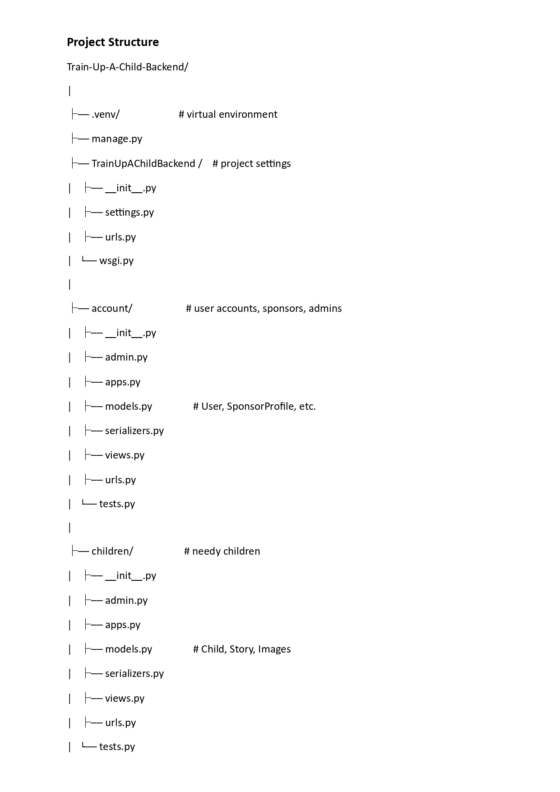
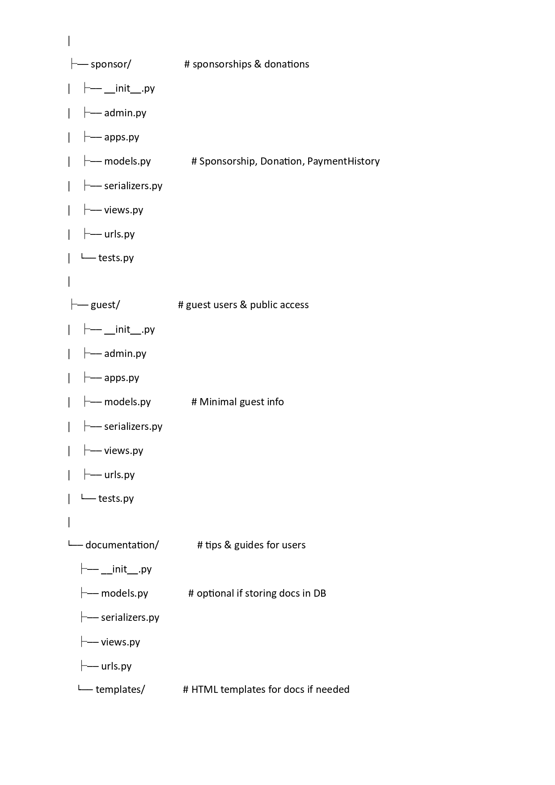
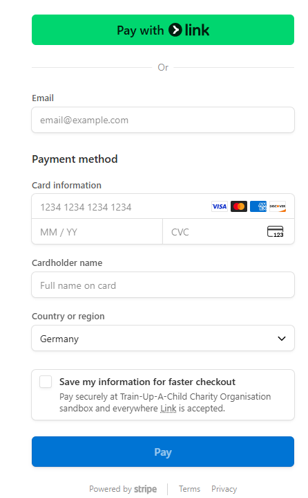

# Train-Up-A-Child-Backend


 > We are a charity Organisation specialized in the area and vision to
help poor children across the continent who have no one to sponsor
their education. We connect volunteers who wish to sponsor such children in their educational careers.

## 🛠 Backend Tech Stack

- **Language**: Python (3.x)
- **Framework**: Django / Django REST Framework (DRF)
- **Database**: PostgreSQL
- **Authentication**: Django Auth / JWT (if applicable)
- **Payment Integration**: Stripe (Checkout, Webhooks)
- **Configuration**: python-decouple (for environment variables)
- **Containerization**: Docker & Docker Compose (if you’re using them)
- **Deployment**: Render / Railway / Heroku (cloud hosting for backend)
- **Web Server**: Gunicorn (for production)
- **Others**:
  - psycopg2 (PostgreSQL adapter)
  - whitenoise (static file serving in production)
  - Stripe CLI (local webhook testing)


# 🚀 Tech Stack

Backend Framework:

Python 3.x

Django
 (with Django REST Framework for APIs)

Database:

PostgreSQL

Payments Integration:

Stripe API
 (Checkout + Webhooks)

Environment & Configuration:

python-decouple
 (for managing secrets and environment variables)

Containerization (optional):

Docker
 & Docker Compose

Deployment (Production-ready options):

Render
, Heroku
, or Railway
 for backend hosting

Gunicorn
 as WSGI server

Other Tools:

Git & GitHub for version control

Stripe CLI for local webhook testing

# ``Summary of End-to-End Flow of Stripe Payment Stages: (to and from Frontend, Backend and Stripe)``
**1.** 	Donor clicks Donate (Frontend) and fills amount. sponsor_id and child_id are also indicated. `
> **``Frontend in Frontend``**  

**2.**	Frontend sends initial collected info from donor (amount, sponsor_id and child_id) to backend. 
> **``Frontend --> Backend``**

**3.**	Backend works on the first stage info ((amount, sponsor_id and child_id) collected from donor on website by creating a checkout session for the payment called Stripe Checkout.
> **``Backend in Backend``**

**4.**	Backend redirects or returns the above created Stripe Checkout URL to Stripe app. 
> **``Backend --> Stripe``**

**5.**	Stripe app processes payment by asking donor for bank card or payment details. 
> **``Stripe --> Frontend``**

**6.**	Stripe notifies backend of a successful payment using Webhook. 
•	When Stripe sends your backend a webhook (HTTP POST request) saying "A payment succeeded", it also sends a signature.
•	You use the Webhook Secret to verify that the request really came from Stripe (not a hacker faking it)
> **``Stripe --> Backend``**

**7.**	Backend updates DB (Donation recorded): 
> **``Backend --> DB``**

**8.**	Notify donor & admin.

      •	Send a confirmation email to donor - a thank-you and successful payment message. 
> **``Frontend --> Email``**

    •	Update donation history in Admin.

> (ToDo)


# Django Backend Tech Stack

Core Framework

Django (Python web framework for backend logic & APIs)

Django REST Framework (DRF) (to expose APIs — e.g., donations, sponsors)

Programming & Config

Python 3.x

python-decouple (to manage environment variables like STRIPE_SECRET_KEY)

Database

PostgreSQL (common for production; SQLite probably in local dev)

Payment Integration

Stripe Python SDK (to create Checkout Sessions, handle webhooks)

Deployment Tools

Gunicorn (WSGI server to run Django in production)

Whitenoise (if serving static files without a separate CDN)

Containerization (optional)

Docker / Docker Compose (if you containerize for easier deployment)

Hosting Choices

Render / Railway / Heroku (full backend hosting for Django + Stripe webhook)

Postgres add-on from your host (for production database)

Webhook Handling

/api/donations/webhook/ endpoint (listens to events like checkout.session.completed)

Optional (depending on your setup)

Celery + Redis (for background tasks, e.g., sending emails after donations)

Sentry (for error tracking)

pytest / unittest (for automated testing)





>README is self-documenting: it shows endpoints, relationships, and working request/response examples.
# 🎯Endpoints: 
**1. ``(browsing)``**
+ http://127.0.0.1:8000/api/sponsors/
+ http://127.0.0.1:8000/api/children/
+ http://127.0.0.1:8000/api/donations/
+ http://127.0.0.1:8000/api/view-children/

**2.``(frontend endpoints)``**


| Endpoint               |          Function          |
|------------------------|----------------------------|

| GET /api/sponsors/     |   ---> list/view sponsors  |
|-----------------------|-----------------------------|                     
                       
| POST /api/sponsors/    |  ---> create/add sponsors |
|------------------------|---------------------------|                    
                       
| GET /api/children/     | ---> list/view children   |
|------------------------|---------------------------|
                   
| POST /api/children/    | ---> create/add children  |
|----------------------|-----------------------------|

|GET /api/donations/    | ---> list/view donations   |
|-----------------------|----------------------------|

| POST /api/donations/  | ---> create/add donations|
|-----------------------|----------------------------|

## API Endpoints

| Endpoint | Method | Description |
|----------|--------|-------------|
| `/api/sponsors/` | GET | List all sponsors |
| `/api/sponsors/` | POST | Create a sponsor |
| `/api/sponsors/<id>/` | GET | Retrieve a single sponsor |
| `/api/sponsors/<id>/` | PUT/PATCH | Update sponsor |
| `/api/sponsors/<id>/` | DELETE | Delete sponsor |
| `/api/children/` | GET | List all children |
| `/api/children/` | POST | Create a child |
| `/api/children/<id>/` | GET | Retrieve a single child |
| `/api/children/<id>/` | PUT/PATCH | Update child |
| `/api/children/<id>/` | DELETE | Delete child |
| `/api/donations/` | GET | List all donations |
| `/api/donations/` | POST | Create donation (via `safe_donation`) |
| `/api/donations/<id>/` | GET | Retrieve a donation (optional if added) |
| `/api/view-children/` | GET | Guest view of children |

# 🚀 API Endpoints Overview

This backend provides REST API endpoints for managing sponsors, children, and donations, with safe unified donation handling.
## 📍 Available Endpoints
| Endpoint              | Method | Description                               |
| --------------------- | ------ | ----------------------------------------- |
| `/api/sponsors/`      | GET    | List all sponsors                         |
| `/api/sponsors/`      | POST   | Create a new sponsor                      |
| `/api/children/`      | GET    | List all children                         |
| `/api/children/`      | POST   | Create a new child                        |
| `/api/donations/`     | GET    | List all donations                        |
| `/api/donations/`     | POST   | Create a new donation (safe transaction)  |
| `/api/view-children/` | GET    | Public/guest view of children (read-only) |

## 🔗 API Flow Diagram

   flowchart TD

    subgraph Sponsors
        A[SponsorProfile]
    end

    subgraph Children
        B[Child]
    end

    subgraph Donations
        C[Donation]
    end

    subgraph Guest
        D[Guest View of Children]
    end

    A --> C
    B --> C
    B --> D

    click A "/api/sponsors/" "API: Sponsors"
    click B "/api/children/" "API: Children"
    click C "/api/donations/" "API: Donations"
    click D "/api/view-children/" "API: Guest View Children"

# 📦 Sample Requests & Responses
## 1️⃣ Create a Sponsor

POST /api/sponsors/

Request:
{
  "name": "John Doe",
  "email": "johndoe@example.com",
  "phone": "+49 123 456789"
}
Response:
{
  "id": 1,
  "name": "John Doe",
  "email": "johndoe@example.com",
  "phone": "+49 123 456789"
}
## 2️⃣ Create a Child

POST /api/children/

Request:
````{
  "name": "Alice",
  "age": 10,
  "balance": 0.0
}
````
Response:
{
  "id": 1,
  "name": "Alice",
  "age": 10,
  "balance": 0.0
}
## 3️⃣ Create a Donation

POST /api/donations/

Request:
````{
  "child": 1,
  "sponsor": 1,
  "amount": 50.0
}
````
Response:

````{
  "id": 1,
  "child": 1,
  "sponsor": 1,
  "amount": 50.0,
  "created_at": "2025-08-23T18:45:00Z"
}
````
##  Public View of Children

GET /api/view-children/

Response:

````[
  {
    "id": 1,
    "name": "Alice",
    "age": 10,
    "balance": 50.0
  }
]
````
✅ Quick test

+ **``Open Django shell``**:

````
python manage.py shell
`````
````
from django.urls import reverse

print(reverse('sponsor-list-create'))  # should output: /api/sponsors/
print(reverse('child-list-create'))    # should output: /api/children/
print(reverse('donation-list-create')) # should output: /api/donations/
````
> If reverse() works, your urls.py is correct.


+ **``Using cURL (same as Postman, but CLI)``**

**POST (create a donation)**

````
curl -X POST http://127.0.0.1:8000/api/donations/ \
  -H "Content-Type: application/json" \
  -d '{"sponsor_id": 1, "child_id": 2, "amount": 50.00}'
````
**GET (list all donations)**
````
curl -X GET http://127.0.0.1:8000/api/donations/
````

> This will return a list of all donations with nested sponsor + child details.

# In PostgreSQL DB: 
````
sudo -u postgres psql

postgres#\c train_up_a_child
````
 > private Developers: for other developer PostgrSQL commands: see developer_next_step.md


**Or, faster and direct:**
````
psql -U truac_user -d train_up_a_child
 ````
+ **``name of database``** is **train_up_a_child**
+ **``owner``** is **name of user** e.g truac_user, amchosen(?), ...
+ relations are tables of children profiles, sponsors profiles, donations, users, account_customers, groups and other tables related by IDs and ForeignKeys

+ **``users``**
                       
  ------------------------------------------------------------
Role name | Attributes`/Authorisation
---
  | ``postgres``    | Superuser (system user), Create role, Create DB, Replication, Bypass RLS |
-------------------------------------------------------------
| ``truac_user`` | Create DB
---------------------------------------------------------------

## Stripe Payments

**``create_checkout_session``** **function** in donations/views.py task:

+ Validates that amount was sent and is a positive number.

+ Prints request.data clearly in the Django console for debugging.

+ Catches and logs Stripe errors separately.

+ Returns descriptive errors to the frontend instead of a vague 400.

### 🔎 How this helps you

+ If your frontend isn’t sending amount, you’ll see "Missing 'amount'".

+ If amount is "abc", you’ll see "Invalid amount 'abc'".

+ If Stripe rejects the request (e.g., API key issue, invalid params), it will be printed as Stripe error:.

+ Every request will log request.data in your Django console so you know exactly what your frontend is sending.


### **Outcome of the ``create_checkout_session``**



# 🔑 Notes

+ stripe login → only once per machine (unless you reset the CLI).

+ stripe listen → must be restarted for every new test session.

+ Use frontend flow to test the user journey.

+ Use backend flow for quick database/webhook checks.


# 🧪 Stripe Payment Testing Flow


| Scenario                                   | Steps                                                                                                                                                                                                                                                                                                                                                                                                                                                           |
| ------------------------------------------ | --------------------------------------------------------------------------------------------------------------------------------------------------------------------------------------------------------------------------------------------------------------------------------------------------------------------------------------------------------------------------------------------------------------------------------------------------------------- |
| **Full Frontend Flow (UI + Backend + DB)** | 1. Start backend:<br>`bash<br>python manage.py runserver  # or uvicorn app.main:app --reload<br>`<br>2. Start frontend:<br>`bash<br>npm run dev<br>`<br>3. Start Stripe CLI webhook forwarding:<br>`bash<br>stripe listen --forward-to localhost:8000/webhooks/stripe/<br>`<br>4. In browser → click **Donate**.<br>5. Complete checkout with test card:<br>4242 4242 4242 4242, exp: 12/34, cvc: 123.<br>6. Verify DB update + backend logs + Stripe CLI logs. |
| **Backend Handling Only (Skip Frontend)**  | 1. Start backend.<br>2. Start Stripe CLI webhook forwarding:<br>`bash<br>stripe listen --forward-to localhost:8000/webhooks/stripe/<br>`<br>3. Trigger event directly:<br>`bash<br>stripe trigger checkout.session.completed<br>`<br>*(Optional: add metadata with `--add` flags)*<br>4. Verify DB update + logs.                                                                                                                                               |

## Sample API Response of Sponsor Target
```
{
  "id": 3,
  "username": "julie123",
  "first_name": "Julie",
  "last_name": "Chime",
  "organization_name": "Train Up A Child",
  "phone": "+49152000000",
  "address": "Berlin, Germany",
  "total_donated": "250.00",
  "supported_children": [
    {"id": 4, "name": "Samuel", "age": 10},
    {"id": 9, "name": "Ruth", "age": 12}
  ]
}

````
````


          ┌──────────────────────┐
          │    User Registers    │
          └──────────┬───────────┘
                     │
          ┌──────────▼───────────┐
          │   Django creates     │
          │   User + SponsorProfile
          └──────────┬───────────┘
                     │
          ┌──────────▼───────────┐
          │   User Logs In       │
          │ (Token issued via DRF)│
          └──────────┬───────────┘
                     │
          ┌──────────▼───────────┐
          │ Sponsor browses      │
          │ available children   │
          └──────────┬───────────┘
                     │
          ┌──────────▼───────────┐
          │ Sponsor donates via  │
          │ Stripe Checkout      │
          └──────────┬───────────┘
                     │
          │ (Stripe Checkout Session)
          ▼
  ┌────────────────────────────────┐
  │ Stripe Payment Gateway (Hosted)│
  └──────────┬─────────────────────┘
             │ (Webhook Callback)
             ▼
  ┌────────────────────────────────┐
  │ Backend Webhook Endpoint       │
  │ - Verify payment               │
  │ - Update Donation (status=paid)│
  └──────────┬─────────────────────┘
             │
             ▼
  ┌────────────────────────────────┐
  │ PostgreSQL Database            │
  │ - Store Donation record        │
  │ - Link to SponsorProfile + Child
  └──────────┬─────────────────────┘
             │
             ▼
  ┌────────────────────────────────┐
  │ Frontend Dashboard Updates     │
  │ - Show Total Donated           │
  │ - Show Supported Children      │
  └────────────────────────────────┘
````


# Project Extention: (NEXT LEVEL)
> + Embed AI
> + app children shall have registered children and verified children sub-apps
> + included photos of children
> + Would you like me to show you how this safe donation flow could be upgraded later to work with Stripe or PayPal for real payments? yes
> + Do you also want me to include a "Quickstart: How to Run Locally" section (with commands for migrations, superuser, running server, etc.) so that anyone cloning your repo can set it up in minutes? yes