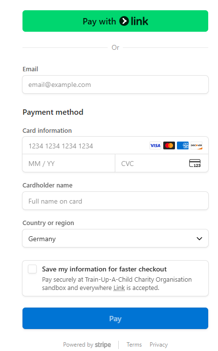

## requirements.txt
After every new installment of any tool or lib, always update the requirements.txt:
````
pip freeze > requirements.txt
````

So far, the donations app:
→ This just creates a **donation record and updates the child’s balance in your database.**
💳 If you want actual payment processing (credit card, PayPal, Stripe, etc.), then:

You’d need to **integrate with a payment gateway (like Stripe or PayPal API)**.


# PostgreSQL Commands

## Start Postgres 

````
sudo -u postgres psql
````
> comment: connects to database "train_up_a_child" as user "postgres".


### ``To list all relations/tables, indexes, constraints, etc. (generally called objects) in a DB:``
````
 postgres=#\d
 ````
### ``To list only relations/tables in a DB:``
````
 postgres=#\dt 
 ````
 
 > comment: dt - ``d``isplay ``t``ables

 ### ``Display a specific table in order to get the field's info e.g data type, contraints, foreign keys, etc``

````
 postgres=#\d donations_donation;
 ````
 or, 
 ### ``Display the table name as just a specified table:``
 ````
 postgres=#\dt donations_donation;
 ````
 ### ``To list only relations/tables in a schema of the current DB:``
````
 postgres=#\dt company 
 ````
 > comment: company is a **schema**

 ### ``To list only a table in a schema of the current DB:``
````
 postgres=#\dt company.employee;
 ````
 > comment: company is a **schema**, employee is a **table**
 
### ``To list schemas in the current DB:``
````
 postgres=#\dn;
 ````
### ``To change/connect to another DB:``
````
 postgres=#\c train_up_a_child;
 ````
> comment: change from current DB - postgres to another DB - train_up_a_child

### ``To list all DBs:``
````
 postgres=#\l;
 ````
>comment: l stands for ``l``ist. 

>A DB is like a project while a schema is like a folder. A table is like an app of a project e.g children. 

### ``To delete a DB:``
````
 postgres=# DROP DATABASE dci;
 ````
 or,
 ````
 postgres=# DROP DATABASE IF EXISTS dci;
 ````
> comment: dci is a DB name.

### ``To display view of an app:``
````
 postgres=#\dv;
 ````
>comment: d stands for ``d``isplay and v stands for ``v``iew. 

### ``To display users of a project``
````
 postgres=#\du;
 ````
>comment: d stands for ``d``isplay and u stands for ``u``sers.

### ``To display data or the actual values of the fields of a table``
````
 postgres=# SELECT * FROM donations_donation;
 ````
>comment: whereby donations_donation is a table name and can contain many data like files or each child's details(name, age).

### ``To quit from a list of objects:``
````
 :q
 ````
 > comment: simply press q to ``q``uit.


### ``To quit from postgres:``
````
 train_up_a_child=# \q
 ````

# NEXT STEP
from chatGPT: Stripe webhook issue - last **1) Backend — Django changes
1.1 account/views.py — Registration API**


## Testing Stripe Payment

####  Bank Test Info
| Card Type   | Number              | Exp        | CVC          | Notes           |
| ----------- | ------------------- | ---------- | ------------ | --------------- |
| Visa        | 4242 4242 4242 4242 | Any future | Any 3 digits | Always succeeds |
| Visa (fail) | 4000 0000 0000 9995 | Any future | Any 3 digits | Always fails    |
| Mastercard  | 5555 5555 5555 4444 | Any future | Any 3 digits | Always succeeds |
| AmEx        | 3782 822463 10005   | Any future | Any 3 digits | Always succeeds |

> ``check if:`` 

+ Stripe returns/reports/stores to backend successfully processed payments ✅
+ And updates PostgreSQL DB ✅


**continue from:** 
+ 
````
sudo -u postgres psql
````
> comment: connects to database "train_up_a_child" as user "postgres".

**Find out: connecting as user postgres vs user truac_user (latest - **```amchosen```**)**
**Later**
Step 1: Connect to PostgreSQL as a superuser
````
sudo -u postgres psql
````
**``or if your user is superuser in PostgreSQL:``** 

````
psql -U postgres
````
> How can I make my user (amchosen) a superuser in PostgreSQL?


chatGPT: Donation flow explanation - 1. What’s happening now in your flow
+ Create a project memory” chat
+ verifying and handling Stripe webhooks in Django
(so you can confirm in your backend that Stripe actually received and processed the payment)
(**see chatGPT: Verify payment webhook Django** and **webhook Django with amount paid** others)

+ i have 3 tech stacks. combine the 3 into the one with bullets
3. deploy with Render or other (**see chatGPT: Verify payment webhook Django** - **``🚀 Step 1: Prepare Your Django Project for Deployment``**)



> To continue, see **chatGPT on ``Verify payment webhook Django``** - 
**🔹 1. Add Metadata When Creating Checkout Session**: Verify payment webhook Django in backend when Donate $50 button is clicked

Still testing the flow locally
Frontend and backend stripe payment testing
 
> + (1) write a Django unit test for create_checkout_session - yes
> + (2) guide you through setting up the Stripe CLI to fully test your webhook events too - yes


+ check data in PostgreSQL DB --> ✅
+ check data uodate in PostgreSQL DB after payment--> ✅Tested with Stripe CLI
````
sudo -u postgres psql 
````
+ Set timezone
ALTER ROLE tuc_user SET timezone TO 'UTC';
•	Ensures that all timestamps stored/retrieved by tuc_user are in Coordinated Universal Time (UTC).
•	This avoids timezone mismatch problems (important for global apps).

+ Embed AI
+ app children shall have registered children and verified children sub-apps
+ include photos of children
+ from PostgreSQL: owner is name of user


✅ So, you have 3 main ways to store and display sponsor & child data:

Admin Panel (easy UI): in-built and at browser

Django Shell (manual testing): 

DRF API (production-ready)

+ extend the ChildSerializer so it also **includes a list of donations (with sponsor, amount, and date)? That way, admins can track donation history directly from a child’s profile.**
yes, please.


+ Would you like me to also show you how to verify in Django Admin / DB that the child’s **balance actually increased after a donation**?

+ Would you like me to also add a nested API response (so when you **fetch a sponsor, you also see their children listed under them**)? That often makes the API much more useful.

+ app children shall have registered children and verified children sub-apps


+ display individual child profile

+ Children/serializers.py:  ChildSerializer → shows all sponsors who donated to the child.
From the child’s side (though by only Admin): “Who is supporting me?”

**Example API Response:**
GET /children/3/
````
{
  "id": 3,
  "first_name": "Mary",
  "last_name": "Adu",
  "story": "Lives with grandmother after parents passed.",
  "balance": "150.00",
  "registered_at": "2025-08-22T12:45:00Z",
  "sponsors": [
    {
      "id": 1,
      "organization_name": "Hope Foundation",
      "user": "hope_admin"
    },
    {
      "id": 2,
      "organization_name": null,
      "user": "jane_doe"
    }
  ]
}
````
# Test these:
+ `/api/sponsors/<id>/` | GET | Retrieve a single sponsor |
+ `/api/children/<id>/` | GET | Retrieve a single child |
+ `/api/donations/<id>/` | GET | Retrieve a donation (optional if added) |

# So far: as of now (Do, 28.08.2025)
+ donation list is empty - nothing is displayed: enter a donation string or real
+ children list has "registered_at = models.DateTimeField(auto_now_add=True)" attribute in models.py `current time of 2 hours LATE`... fix this
> Goto PostgreSQL and perform this command:
Set timezone

**ALTER ROLE tuc_user SET timezone TO 'UTC';**

•	Ensures that all timestamps stored/retrieved by tuc_user are in Coordinated Universal Time (UTC).

•	This avoids timezone mismatch problems (important for global apps).
________________________________________
